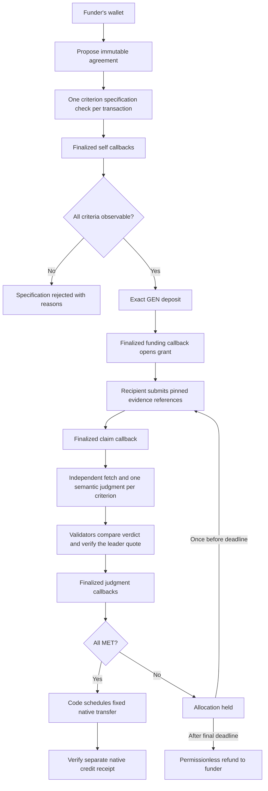

# Tranche

**Grant money that follows shipped work, not promises.**

Tranche is a milestone grant escrow on GenLayer StudioNet. A funder freezes a budget and observable acceptance criteria. A named recipient submits public evidence. Validators fetch each artifact themselves, judge one criterion at a time, and verify that the leader's quoted passage appears in their independently fetched source. Code releases the predetermined allocation only after all criterion judgments finalize as `MET`.

The home page opens on a real three-milestone grant without requiring a wallet. Recorded receipts and fresh finalized reads are explicitly distinguished. See [deploy/proof.json](deploy/proof.json) for actual addresses, transaction hashes and outcomes; absence of proof is never replaced by a fabricated successful example.

## Architecture



The browser owns forms, previews and resumable transaction tracking. Next.js read-only API routes provide finalized chain reads and bounded evidence previews. They have no signing key. The Python contract owns acceptance, role checks, deadlines, frozen hashes, resubmission limits and settlement. No backend or administrator can write a verdict or choose an amount.

## Run locally

Requires Node.js 22+ and Python 3.12/3.13.

```sh
npm ci
npm run dev
uv venv --python 3.12 .venv
uv pip install --python .venv -r requirements.txt
uv venv --python 3.12 .release-venv
uv pip install --python .release-venv -r requirements-release.txt
npm run lint:contract
npm run test:contract
npm test
npm run typecheck
npm run lint
npm run build
npm run verify:proof
```

The development app is at `http://localhost:3200`. The checked-in proof supplies the deployed contract address; `NEXT_PUBLIC_TRANCHE_CONTRACT` can override it. `.env.example` contains no secrets. Wallet actions use MetaMask and the GenLayer plugin on StudioNet chain `61999`; browsing proof requires no wallet.

## Mechanism

1. Propose one to three milestones, each with one to five criteria. Positive integer-wei allocations must sum exactly to the grant budget.
2. Check every criterion for observability. Each check is independently verified and finalized by a self-only callback. A rejected agreement cannot be funded.
3. The original funder deposits the exact budget after `SPEC_ACCEPTED`. The immutable specification's SHA-256 hash is retained.
4. Only the named recipient can claim before the milestone deadline, submitting exactly one allowlisted reference per criterion.
5. Anyone can request each criterion judgment. Validators independently fetch and assess the evidence. They must agree on the verdict and confirm the leader's quoted passage in their own document, with matching SHA and publication timestamp.
6. Finalized callbacks derive the milestone outcome: all `MET` releases; any `NOT_MET` holds; otherwise `INSUFFICIENT_EVIDENCE` holds. The model never sets an amount.
7. A held milestone permits one resubmission before its deadline. Prior evidence and judgments remain in history. After the final milestone deadline, anyone can refund unpaid allocations to the original funder.

## Evidence and limitations

GitHub releases and tags resolve to a full commit SHA. Release deadlines use `created_at`, never author-controlled commit dates. GitHub files are fetched from raw.githubusercontent.com at a pinned SHA. npm uses exact version metadata and the registry's publication time. Archive evidence requires the exact `id_` URL and matching CDX timestamp/original-URL row. StudioNet contract evidence checks the public RPC schema, because the explorer itself is a JavaScript application.

GitHub release/tag pointers and release notes can be edited by their owners. The demo uses a third-party repository and records the exact observed SHA and passage. Pinning the commit does not make release notes immutable. A tag or pinned file has no trustworthy publication date in this design: the recipient's on-chain submission deadline is enforced, but the contract does not claim to establish the historical publication time of that file. Large or inaccessible documents produce insufficient evidence, with funds held. Individual public reads are bounded, and model input is capped at 40,000 characters. The GitHub release-page fallback is used only when it supplies both a matching SHA and a publication timestamp; otherwise evidence stays insufficient.

The native appeal window is reflected by the stored transaction lifecycle. Callbacks wait for finalization, and native transfers have separate credit receipts. A pending on-time claim has a maximum one-hour adjudication grace period after its milestone deadline; refund cannot cut that process short. After that grace period it can be refunded, and late callbacks cannot release the allocation. The app tracks while open and resumes after reload; it does not operate a background keeper or custom appeal court.

StudioNet is a development simulator, not custody of real-value tokens. Failed payable simulator calls may leave a native balance credited even when contract state rolls back; the retained first-attempt funding receipt illustrates this limitation. The app offers funding only after a fresh finalized accepted specification. Escrow accounting is per grant; unrelated direct transfers are not an owner's withdrawable balance. No production-security claim is made.

## Verification and submission

The direct tests cover allocation conservation, specification rejection, finality gates, all outcomes, nonexistent artifacts, missing quoted passages, prompt-injection data, independent validator comparisons, authorization, resubmission, expiry, source/SHA checks and double release. Live probes establish validator access to GitHub API, raw GitHub, npm and archive.org. The funded demo must prove all three verdicts and an explicitly credited native transfer; `npm run verify:proof` performs read-only receipt, source and finalized-state checks.

See [docs/VERIFICATION.md](docs/VERIFICATION.md), [docs/TUTORIAL.md](docs/TUTORIAL.md), [docs/DEMO.md](docs/DEMO.md) and [docs/submission/portal-fields.json](docs/submission/portal-fields.json). The owner submits to the Portal. No Portal submission is automated.
